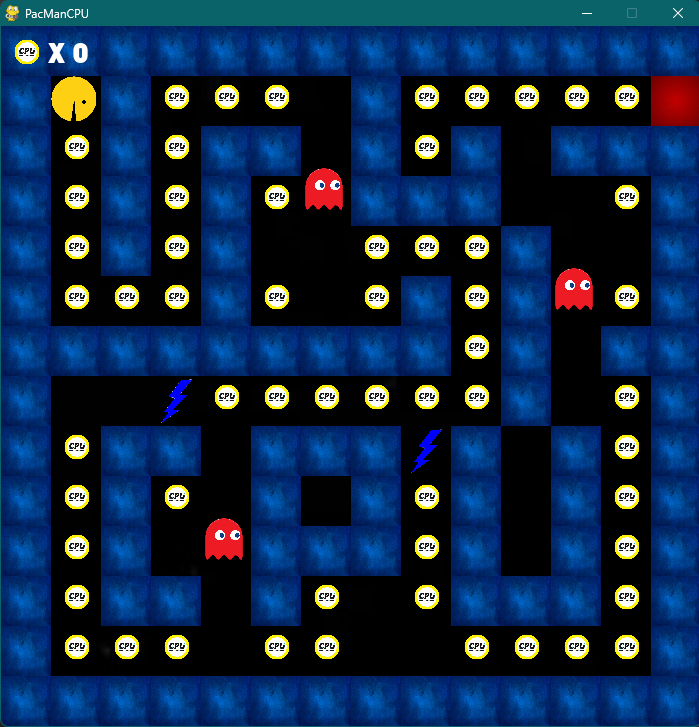
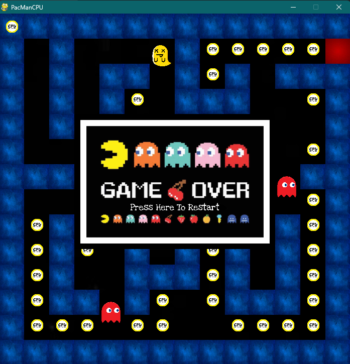
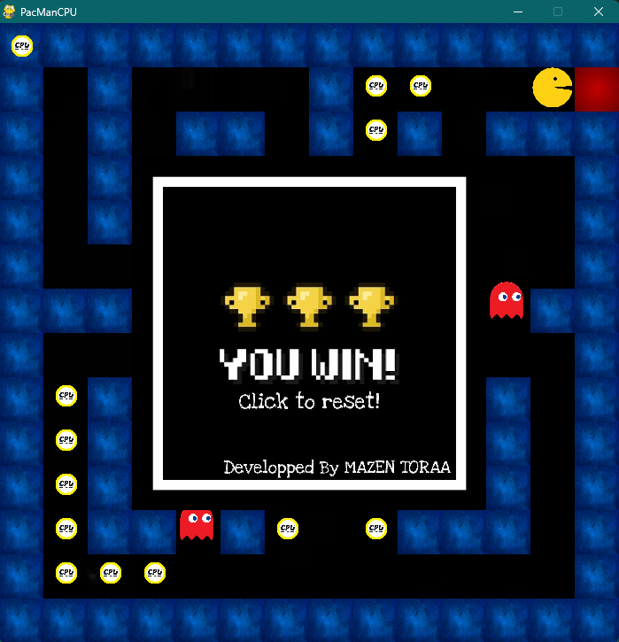

# Pacman Clone Game (Pygame)

This is a simple Pacman clone game built using **Pygame**. The game consists of **one level** where the player controls Pacman and tries to:

- Reach the **red tile** to win the level.
- Avoid monsters that move within specific fields.
- Eat as many coins as possible.
- Avoid obstacles blocking your path.

The gameplay is straightforward and engaging, making it a fun challenge to complete the level without getting caught by monsters.





---

## Features

- Single playable level with a clear goal.
- Monsters patrol specific areas adding challenge.
- Coins to collect for extra points.
- Obstacles that require careful navigation.
- Easily extensible to support multiple levels, different maps, or new challenges.

---

## How to Play

1. Clone the repository:

   ```bash
   git clone https://github.com/mazentoraa/PacManCPU-Game.git
   ```
2. Navigate to the /dist folder:
3. Run the executable app inside /dist.

For easier access, create a shortcut to the executable and place it on your desktop.
